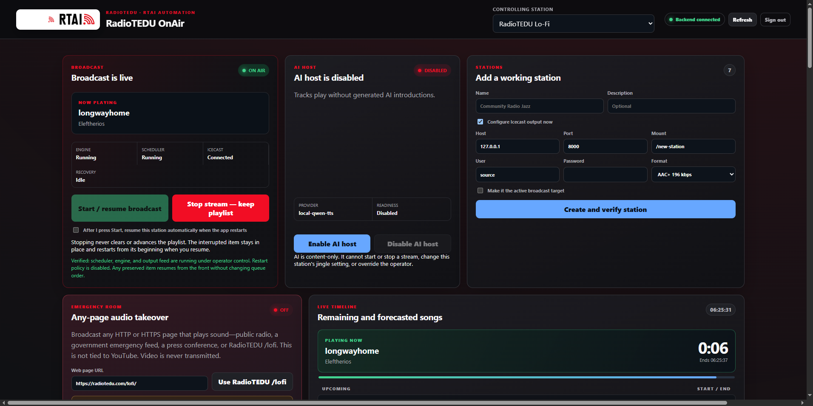

<p align="center">
  
</p>

<h1 align="center">RadioTEDU OnAir</h1>

<p align="center">
  Unattended, deterministic multi-channel broadcasting for RadioTEDU.
</p>

<p align="center">
  
  
  
  
</p>

RadioTEDU OnAir is the broadcast engine, operator wall, desktop shell, and Windows service used to keep RadioTEDU's music stations on air. Each station has an independent library, queue, playout worker, Icecast connection, output fan-out, and recovery loop. A failed mount reconnects independently; it does not restart the programme or interrupt sibling stations.



## Public stream contract

The unsuffixed mount is always the normal stream. Low-bandwidth streams use `-low`. Lossless output is deliberately limited to Classical and Cazz.

| Radio | Low — HE-AAC v1 96 kbps | Normal — HE-AAC v1 192 kbps | Lossless — FLAC |
|---|---|---|---|
| RadioTEDU | `/radio-low` | `/radio` | — |
| Lo-Fi | `/lofi-low` | `/lofi` | — |
| Classical | `/classic-low` | `/classic` | `/classic-flac` |
| Cazz | `/cazz-low` | `/cazz` | `/cazz-flac` |
| Rock | `/rock-low` | `/rock` | — |
| Energetic | `/energize-low` | `/energize` | — |

This PC owns 14 local music sources: six normal, six low, and two FLAC. The externally operated `/en` and `/fr` AI sources bring the complete RadioTEDU plan to 16 mounts. Retired `-normal`, `-high`, and non-approved FLAC branches are removed during commissioning.

### Icecast metadata naming

The source handshake sends Icecast `Ice-Name`, `Ice-Description`, `Ice-Genre`, `Ice-URL`, and `Ice-Public` for every local mount. Low-quality mounts intentionally reuse the normal station name; the word “Low” is not exposed in the public stream title. FLAC names are explicit:

| Mount(s) | Icecast name | Description | Genre |
|---|---|---|---|
| `/radio`, `/radio-low` | `RadioTEDU` | `RadioTEDU live stream` | Pop |
| `/lofi`, `/lofi-low` | `RadioTEDU Lo-Fi` | `RadioTEDU Lo-Fi live stream` | Lo-Fi |
| `/classic`, `/classic-low` | `RadioTEDU Classic` | `RadioTEDU Classic live stream` | Classical |
| `/classic-flac` | `RadioTEDU Classic FLAC` | `RadioTEDU Classic FLAC live stream` | Classical |
| `/cazz`, `/cazz-low` | `RadioTEDU Jazz` | `RadioTEDU Jazz live stream` | Jazz |
| `/cazz-flac` | `RadioTEDU Jazz FLAC` | `RadioTEDU Jazz FLAC live stream` | Jazz |
| `/rock`, `/rock-low` | `RadioTEDU Rock` | `RadioTEDU Rock live stream` | Rock |
| `/energize`, `/energize-low` | `RadioTEDU Energize` | `RadioTEDU Energize live stream` | Energetic |

During playback the app updates Icecast’s supported single `song` field on each output as `Artist - Title (Album)` (empty fields are omitted). Icecast does not provide separate standard artist and album metadata fields through `/admin/metadata`, so this combined value is the portable representation used by listener clients.

The Windows service runs with `CLEANROOM_SKIP_ICECAST_METADATA=0` so these updates are active. AI startup remains independently disabled with `CLEANROOM_SKIP_STARTUP_AI=1`; enabling metadata does not enable AI, voting, or any auxiliary service.

### HLS readiness

HLS is implemented in **Settings → HLS** but remains operator-controlled and stored **Off** until the Nginx server is prepared. When started, each normal mount is read from Icecast and published as HE-AAC v1 HLS: Low 96 kbps and High 192 kbps, 48 kHz stereo, six-second segments. HLS start does not stop Icecast. The app never falls back from HE-AAC to Opus.

### Daily play history and off-machine backup

Every completed music or jingle play is committed to the append-only,
hash-chained `music_usage_log` ledger. The exporter continuously refreshes
`Desktop\RadioTEDU Play History` with dated all-radio event/count CSVs, current-day
aliases, all-time totals, and an integrity manifest. Each row carries the
station name and mount, so Classical, Lo-Fi, Pop, Jazz, Rock, and Energize are
all retained in every daily report. The Windows tasks
`RadioTEDU-OnAir-PlayHistory-Export` (five-minute refresh) and
`RadioTEDU-OnAir-PlayHistory-GitHub` (nightly) use the scripts in `scripts\` to
copy the complete folder to the dedicated private repository
[`radiotedu/RadioTEDU-OnAir-Play-History`](https://github.com/radiotedu/RadioTEDU-OnAir-Play-History).
See [`docs/PLAY_HISTORY_BACKUP.md`](docs/PLAY_HISTORY_BACKUP.md) for the task,
path, validation, and recovery details. No GitHub token or password is stored
in the application repository.

## Designed to survive a reboot

The stream is not tied to the desktop window. `RadioTEDU.OnAir.Supervisor` is an immediate automatic Windows service with failure recovery. At machine startup it launches the backend, restores the six operator-authorized station workers, and starts the actual Icecast source pipelines—even if nobody signs in or opens the app.

The commissioning command enables `broadcast_autostart_enabled` for the six music stations, enforces HE-AAC v1 192 on their primary mounts, writes the approved HE-AAC v1 96 low outputs plus the two FLAC mounts, makes an integrity-checked database backup, and preserves protected Icecast credentials. A one-time startup migration converts legacy canonical Ogg/Opus outputs without touching `/classic-flac` or `/cazz-flac`.

```powershell
python .\tools\commission_quality_outputs.py `
  --backup-root "C:\ProgramData\RadioTEDU\OnAir\backups\quality-commission"
```

Install or repair the machine service from an elevated PowerShell prompt:

```powershell
powershell -ExecutionPolicy Bypass -File .\tools\Install-RadioTEDU-OneShot.ps1
```

## What is included

| Area | Responsibility |
|---|---|
| `app/` | FastAPI control plane, playout engine, persistence, stream fan-out, operator UI |
| `desktop/` | Windows desktop shell and tray integration |
| `tools/` | Service installation, commissioning, watchdogs, recovery, verification |
| `installer/` | Windows installer authoring and prerequisites |
| `tests/` | Python, JavaScript, integration, installer, and reliability contracts |
| `docs/` | Architecture, operations, recovery, and operator guidance |

## Development

Use Python 3.12 on Windows. Runtime state, databases, credentials, media, generated packages, and local tool bundles do not belong in Git.

Local development stays simple: `uvicorn app.main:app --reload` or `python run_cleanroom.py`.

```powershell
python -m pip install --only-binary=:all: -r requirements.lock
uvicorn app.main:app --host 127.0.0.1 --port 18110
```

Open `/login.html`, authenticate through `/api/auth/login`, and then open `http://127.0.0.1:18110/app`. JWT-protected APIs include queue, playout, studio, audio, and administration operations; the queue API now persists to SQLite. The single supported product path exposes the On Air wall, Playlists, settings, diagnostics, and the desktop shell.

The playout engine uses an FFmpeg-backed transition for `music -> music` where supported and a deliberate hard cut for ads and other interruption-sensitive boundaries. Legacy data can be brought forward with `scripts\import_legacy_data.py`.

Run the core verification gates:

```powershell
python -m pytest tests -q
node --test tests\js\*.test.cjs
node --check app\static\onair\app.js
```

## Windows installer and first launch

The Windows installer produces `Setup.exe` for either the current user or all users. The desktop shell lives in the system tray; its tray menu opens the operator wall, reports backend state, and performs controlled start, restart, or shutdown actions without owning the stream service.

On first launch, the managed dependency bootstrap verifies or installs `yt-dlp`, FFmpeg, `ffplay`, and `ffprobe` under `%LOCALAPPDATA%\RadioTEDU OnAir\Tools`. Packaged smoke tests use `CLEANROOM_OPEN_PANEL=0` and a free loopback port so validation never opens an operator browser or collides with the live service.

Build and validate the packaged backend, portable release, and desktop installer:

```powershell
powershell -ExecutionPolicy Bypass -File .\build_backend_onefile.ps1
powershell -ExecutionPolicy Bypass -File .\package_portable_release.ps1
powershell -ExecutionPolicy Bypass -File .\installer\build_setup.ps1
powershell -ExecutionPolicy Bypass -File .\smoke_test_desktop_bundle.ps1
```

`last_build_path.txt` and `last_setup_path.txt` record the verified backend and installer artifacts used by the smoke workflow.

## Browser audio and deployment

Admin and DJ roles can use browser microphone permission for push-to-talk or always-on live mic sessions. The current browser capture path uses `MediaRecorder`, `/api/audio/live/settings`, and the authenticated `/ws?token=...&station_id=...` channel. WebRTC can be enabled with `WEBRTC_ENABLED`; production deployments that need relay should configure `WEBRTC_TURN_URL` and matching TURN credentials.

For reverse-proxy deployment, place the app behind HTTPS and let the browser reach `/ws` over WSS. The recommended proxy path is Caddy or an equivalent HTTPS terminator. Keep the app itself on HTTP and terminate TLS at the proxy.

- Set `PUBLIC_BASE_URL` when you know the external origin, for example `https://radio.example.com`.
- Set `CORS_ORIGINS` to the public origins that should be allowed, for example `https://radio.example.com,https://ops.example.com`.
- Set `TRUST_PROXY_HEADERS=true` when the app is behind a trusted reverse proxy that overwrites `X-Forwarded-Proto`, `X-Forwarded-Host`, and `X-Forwarded-For` for login rate limiting.
- Leave `SECURITY_HEADERS_ENABLED` on unless you are explicitly debugging a browser quirk.
- Confirm the websocket connects to `wss://<public-host>/ws?token=...&station_id=...`.
- Confirm `/api/*` traffic is not being cached by the service worker.

## Operating guarantees

- One programme timeline fans out to every quality branch; variants do not create duplicate repertoire events.
- Primary mount names, source usernames, passwords, host settings, devices, gain, and protocol remain protected during quality commissioning.
- Quality-output settings never persist copies of source credentials.
- A source is reported healthy only after verified delivery, not merely because a TCP connection opened.
- AI cannot veto deterministic music continuity or acquire authority over start/stop state.
- Every material configuration mutation is read back before the operator wall reports success.

See [Quality-output architecture](docs/QUALITY_OUTPUTS_ARCHITECTURE.md), [16-mount operations](docs/16_MOUNT_STREAM_OPERATIONS.md), and [Deterministic operator guide](docs/DETERMINISTIC_OPERATOR_GUIDE.md).

## Security and publication boundary

The repository contains source and reviewable configuration only. `.env` files, SQLite databases, JWT material, credential stores, certificates, keys, logs, media libraries, build output, and machine-local service data are excluded. Live secrets remain in the Windows-protected RadioTEDU data root.

## License

RadioTEDU OnAir is distributed under the terms in [LICENSE.md](LICENSE.md). Copyright © TED University / RadioTEDU.
